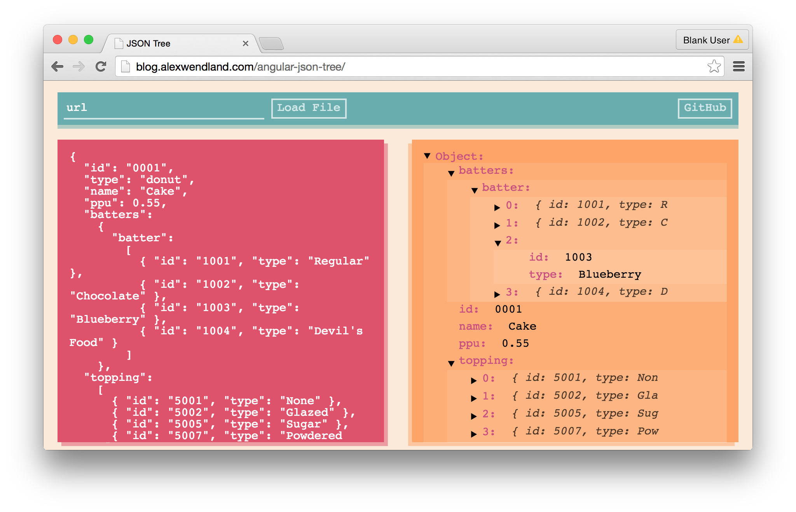

# JSON Tree Visualizer

Example [AngularJS](https://angularjs.org/) app implementing [angular-json-tree](https://github.com/awendland/angular-json-tree/tree/master). In the following screenshot, angular-json-tree generates the expandable tree visualization on the right from the inputted JSON string on the left.

Useful for visualizing JSON from files, APIs and text. The live version can be found at [http://blog.alexwendland.com/angular-json-tree/](http://blog.alexwendland.com/angular-json-tree/).

